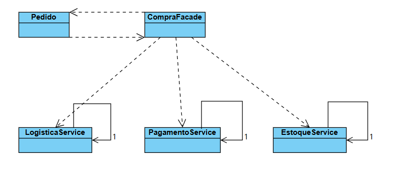

# Padrão Facade - Exemplo E-commerce

Este projeto é uma implementação didática do padrão de projeto estrutural Facade em Java. O objetivo é demonstrar como encapsular a complexidade de vários subsistemas de um E-commerce (Estoque, Pagamento, Logística) por trás de uma interface simplificada para o cliente.

## Sobre o Projeto

No contexto de uma loja virtual, o processo de finalizar uma compra envolve diversas etapas complexas que não devem ser expostas diretamente ao cliente final ou à classe de domínio principal.

O padrão **Facade** é utilizado aqui para fornecer uma classe única (`CompraFacade`) que orquestra as chamadas para:
1.  **EstoqueService**: Verifica disponibilidade de produtos.
2.  **PagamentoService**: Processa a transação financeira.
3.  **LogisticaService**: Agenda a entrega.

## Estrutura do Código

### Cliente
- **Pedido:** Representa a compra do cliente. Ao chamar o método concluir(), ele delega toda a complexidade para a Facade, sem conhecer os serviços internos.

### Facade
- **CompraFacade:** A classe principal que simplifica a interface. Ela contém a regra de negócio que define a ordem de execução: verifica estoque -> cobra -> envia. Se qualquer etapa falhar, o processo é interrompido.

### Subsistemas (Serviços)
Os serviços são independentes:

- **EstoqueService:** Singleton. Simula a verificação de inventário.

- **PagamentoService:** Singleton. Simula a aprovação de pagamento baseada no valor.

- **LogisticaService:** Singleton. Simula o agendamento de frete.

## Diagrama de Classes

